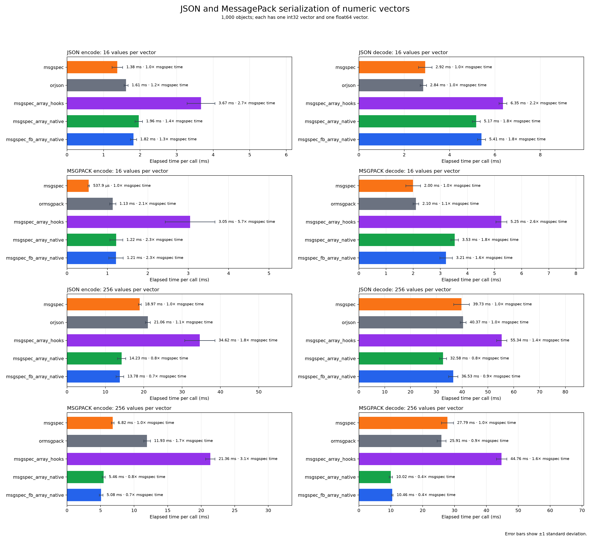
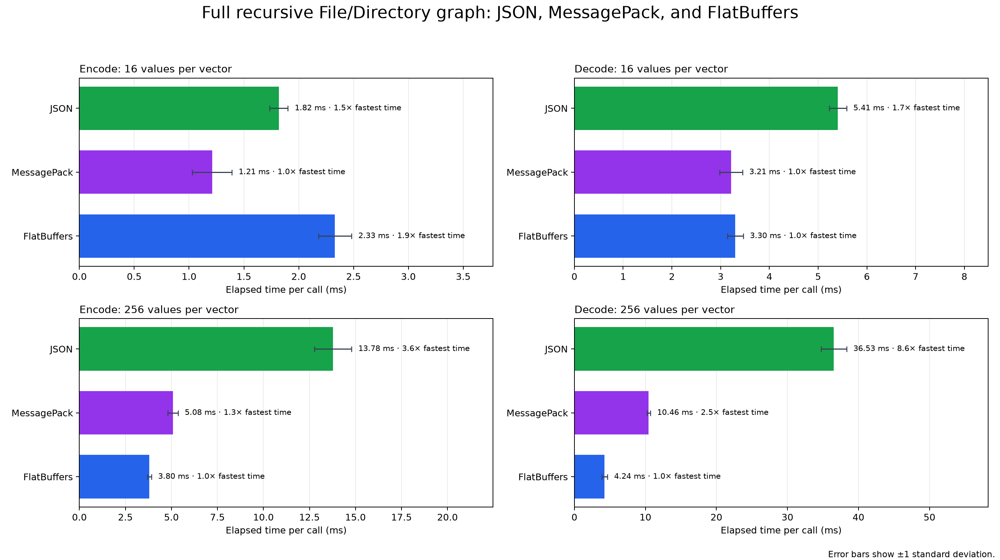

# Benchmarks

These results compare single-threaded serialization APIs on the same machine.  The current images were generated using:

- Intel Core i7-8650U CPU
- CPython 3.13.5 on Linux
- msgspec 0.21.1, NumPy 2.5.2, Python FlatBuffers 25.12.19, `flatc` 23.5.2, msgspec-flatbuffers 0.1.0

The measured process ran on one isolated core.

msgspec_serde generated API vs. official Python FlatBuffers API


The msgspec_serde generated API is approximately 20–22 times faster to encode and 11–13 times faster to materialize in these profiles. Selected-field access is about 1.2 times faster, while full traversal ranges from 1.5 to 2.9 times faster.

## Extended msgspec serialization benchmark

This workload extends the benchmarks in the `msgspec` repo.  It contains 1,000 generated `File` and `Directory` objects. We extended each object to have one `int32` vector and one `float64` vector.  These benchmarks compare ser/de when including vector lengths of 16 and 256.

The compared representations are:

| Figure label | Representation |
| --- | --- |
| `msgspec` | The upstream msgspec Struct shape with Python-list vectors. |
| `orjson` / `ormsgpack` | Python dictionaries with Python-list vectors, encoded with orjson or ormsgpack. |
| `msgspec_array_hooks` | A regular msgspec Struct with NumPy arrays, encoded with `msgspec.{json,msgpack}` and array hooks. |
| `msgspec_array_native` | A regular msgspec Struct with NumPy arrays, encoded with `msgspec_serde.{json,msgpack}`. |
| `msgspec_fb_array_native` | A msgspec Struct generated from FlatBuffer IDL with NumPy arrays, encoded with `msgspec_serde.{json,msgpack}`. |



## Full recursive object graph: FlatBuffers, JSON, and MessagePack

This comparison selects the IDL-generated model from the preceding benchmark
and uses the same complete 1,000-object File/Directory graph for all three
formats. NumPy is used only for the `int32` and `float64` vector fields.
FlatBuffers decode materializes the complete model.



* For 16-value vectors, MessagePack encodes fastest and FlatBuffers materializes fastest.

* At 256 values, FlatBuffers is fastest in both directions.

## Reproduce the report

Install the locked project and benchmark dependencies:

```shell
just sync
mkdir -p benchmark-results/report-inputs benchmarks/images
```

Capture the extended msgspec profile as JSON lines:

```shell
just benchmark-upstream-profile -n 1000 \
  > benchmark-results/report-inputs/msgspec-profile.jsonl
```

Capture the external-library and FlatBuffers encoding comparisons:

```shell
: > benchmark-results/report-inputs/encodings.jsonl
for protocol in json msgpack flatbuffers; do
  for vector_length in 16 256; do
    just benchmark-upstream-encodings \
      -p "$protocol" \
      -n 1000 \
      --vector-length "$vector_length" \
      >> benchmark-results/report-inputs/encodings.jsonl
  done
done
```

Run the first-party comparison against the official Python FlatBuffers Object API. Pyperf does not overwrite an existing result file, so choose a new path for each run.

```shell
just benchmark \
  --affinity 2 \
  -o benchmark-results/report-inputs/python-flatbuffers.json
```

Generate the report images:

```shell
just benchmark-report \
  --profile-results benchmark-results/report-inputs/msgspec-profile.jsonl \
  --encoding-results benchmark-results/report-inputs/encodings.jsonl \
  --flatbuffers-results benchmark-results/report-inputs/python-flatbuffers.json \
  --output-dir benchmarks/images
```

The command writes:

- `benchmarks/images/msgspec-extended.png`
- `benchmarks/images/idl-codec-comparison.png`
- `benchmarks/images/python-flatbuffers-comparison.png`

Each result option accepts multiple files. Duplicate JSON-line rows are averaged after confirming that their wire sizes match. Multiple pyperf files are combined only when their recorded environment and dependency metadata match. Non-JSON runner status lines in captured JSON-line files are ignored.
